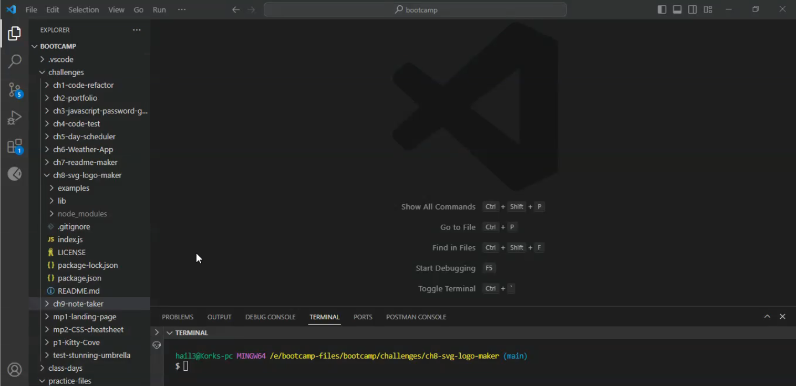

# SVG Logo Maker

## Description

This is a node app that will automatically make a simple SVG type logo using javascript. This was created to make simple logos for future websites as placeholders. When making this project, my biggest challenge was figuring out how to use exported classes. I got frequent error messages where the Shape class was improperly exported. This problem got fixed by changing the variables to this.shape, this.txt, this.txtColor, etc. 
    
## Table of Contents

- [Installation](#Installation)
- [Usage](#Usage)
- [License](#License)
- [Contributing](#Contributing)
- [Tests](#Tests)
- [Questions](#Questions)
    
## Installation

You can use this app by cloning the repo to your folder.

## Usage
    
To use this app, navigate to the repo in your terminal. Then, install the packages in the package.json file. When that is complete, simply type node index. It will run this project after a few seconds of buffering.

[Video Link]()

## License

This project is covered under the MIT license. For more information, visit the link below.

[License Link](./LICENSE)

## Contributing

This is a bootcamp project, I will not accept contributions at this time.
    
## Tests

You can test this application by running the shapes.test.js located inside the lib folder.
    
## Questions

Have any questions? This is how to contact me:

Github: https://github.com/RuckusEnjoyer
